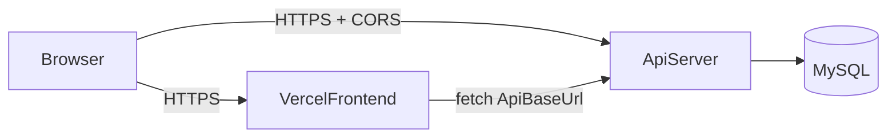

## 목표

- 프론트(Next.js UI)는 Vercel `azas-project.vercel.app`에서 계속 제공
- 백엔드는 `app/api/**` 라우트들을 별도 API 서버(예: Fastify/Express)로 이동
- 브라우저 제약을 피하기 위해 **쿠키 인증 대신 Bearer JWT**로 전환
- CORS/HTTPS/환경변수 분리까지 포함해 운영 가능한 형태로 마이그레이션

## 현재 상태(리포에서 확인)

- **쿠키 기반 JWT**: `middleware.ts`, `lib/jwt.ts`, `app/api/auth/*`가 `auth_token` 쿠키를 사용
- 프론트 로그인 상태는 `contexts/AuthContext.tsx`가 `/api/auth/session` 등을 호출해 결정

## 권장 아키텍처

- 프론트는 `NEXT_PUBLIC_API_BASE_URL`(예: `https://api-server.example` 또는 `https://<backend-ip-or-domain>`)로 백엔드를 호출
- 백엔드는 TLS(HTTPS)를 반드시 사용(리버스 프록시 nginx/Caddy 또는 Cloudflare Tunnel/ALB 등)
- 인증은 `Authorization: Bearer <jwt>` 헤더로 전달

## 구현 개요

- **1단계: 백엔드 스캐폴딩**
  - 새 프로젝트(예: `backend/`) 생성
  - 런타임: Node.js
  - 프레임워크: Fastify(추천) 또는 Express
  - 공통 유틸/DB 코드는 `lib/`에서 백엔드로 이동/복사
- **2단계: 인증 전환(쿠키 → Bearer JWT)**
  - 백엔드에서 로그인 API는 `{ token, user }`를 JSON으로 반환
  - 프론트는 token을 메모리/스토리지에 저장(보안-편의 트레이드오프 문서화)
  - 기존 `middleware.ts`의 쿠키 검증 로직은 프론트에서 제거(또는 최소화)
  - 백엔드에 JWT 검증 미들웨어 추가(라우트 보호)
- **3단계: API 라우트 이전**
  - `app/api/**` 라우트별로 백엔드의 `/api/**` 엔드포인트로 이관
  - 프론트에서 `fetch('/api/...')`를 `fetch(`${API_BASE_URL}/api/...`)`로 변경
- **4단계: CORS 설정**
  - 백엔드에서 `Origin: https://azas-project.vercel.app` 허용
  - `Authorization` 헤더 허용
  - 프리플라이트(OPTIONS) 처리 확인
- **5단계: 배포/운영**
  - 백엔드 서버를 Lightsail/EC2 등에 배포하고 HTTPS 종단 구성
  - 환경변수 분리: 프론트는 `NEXT_PUBLIC_API_BASE_URL`, 백엔드는 DB/JWT 시크릿
  - 점진적 전환(일부 API만 먼저 이전) 후 전체 전환

## 변경 대상 파일(대표)

- 프론트
  - `contexts/AuthContext.tsx` (세션 체크/로그인/로그아웃을 Bearer 기반으로 변경)
  - 각 대시보드 페이지/컴포넌트의 fetch 호출부 (상대경로 `/api/...` → 절대경로 `${API_BASE_URL}/api/...`)
  - `middleware.ts` (쿠키 검증 제거 또는 최소화)
- 백엔드(신규)
  - `backend/src/routes/auth.ts`
  - `backend/src/routes/dashboard/*` (기존 `app/api/dashboard/*` 이관)
  - `backend/src/db/*` (mysql2 연결/쿼리 유틸)
  - `backend/src/middlewares/auth.ts` (JWT verify)

## 테스트/검증

- 로컬에서
  - 프론트: `NEXT_PUBLIC_API_BASE_URL=http://localhost:4000`
  - 백엔드: `localhost:4000`
  - 로그인 → 토큰 발급 → 대시보드 API 호출 성공
- 배포 후
  - Vercel 프론트에서 백엔드 HTTPS 호출(혼합콘텐츠 없음)
  - CORS/프리플라이트 정상
  - 토큰 만료/재로그인 흐름 정상

